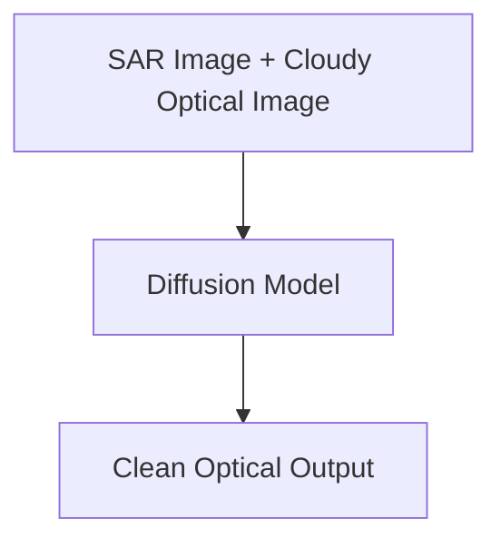

# ClearSightSAR: SAR-Guided Latent Diffusion for Cloud Removal

An implementation of a Latent Diffusion Model (LDM) designed to reconstruct cloud-free optical satellite imagery by conditioning on Synthetic Aperture Radar (SAR) data.



##  Project Overview
Optical satellite imagery is frequently obstructed by thick cloud cover, rendering it useless for critical geospatial analysis. This project tackles that limitation by utilizing a conditional diffusion architecture. By pairing cloudy optical images with cloud-penetrating SAR data, the model learns the underlying geographical structures and successfully "inpaints" the missing landscape in the optical domain.

##  Architecture
* **Variational Autoencoder (VAE):** A custom CNN-based autoencoder trained to compress 256x256 high-resolution satellite patches into dense 32x32 latent representations, drastically reducing compute requirements and enabling local GPU training.
* **Conditional UNet:** The core diffusion model that denoises the latents. It is explicitly conditioned on a concatenated tensor of both the cloudy optical latent and the SAR structural latent.
* **Denoising Scheduler:** Utilizes a DDPM scheduler for the reverse diffusion (inference) process.

##  Results & Metrics
The model was trained and evaluated locally under strict hardware compute constraints, successfully establishing a baseline for the architecture's viability.

* **PSNR:** 16.0812
* **SSIM:** 0.2431
* **LPIPS:** 0.8158

### Visual Reconstruction
*(The progression below shows the cloudy optical input, the guiding SAR data, the AI-generated reconstruction, and the actual ground truth.)*


##  Tech Stack
* **Deep Learning Frameworks:** PyTorch, HuggingFace Diffusers
* **Computer Vision:** OpenCV, LPIPS Perceptual Loss
* **Data Processing:** NumPy, Matplotlib

## Limitations & Future Work
Limited training data and compute resources constrained model performance.
Generated outputs occasionally exhibit land-cover hallucination and color bias.
Stronger SAR conditioning at multiple UNet scales may improve structural consistency.
Future work includes larger datasets, improved conditioning strategies, and higher-capacity diffusion backbones.

##  Local Setup
```bash
# Clone the repository
git clone [https://github.com/ritikashinde/ClearSightSAR.git](https://github.com/ritikashinde/ClearSightSAR.git)


# Install dependencies
pip install -r requirements.txt

# Run inference to generate a cloud-free image
python scripts/04_generate_image.py
